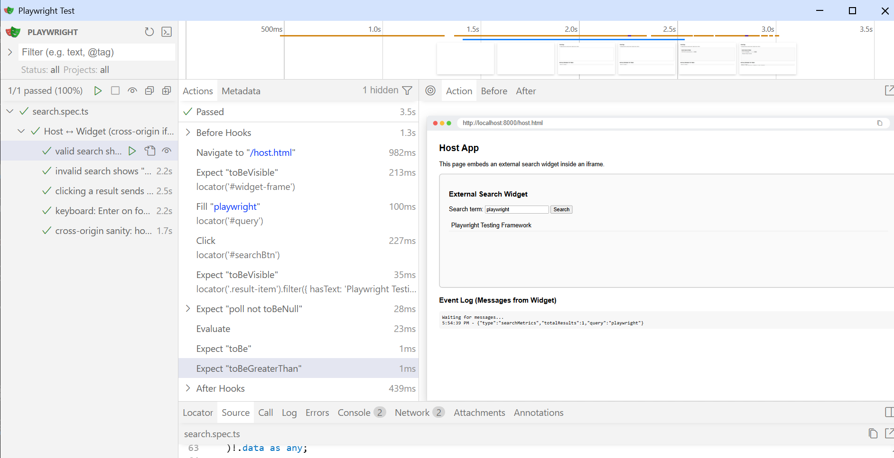
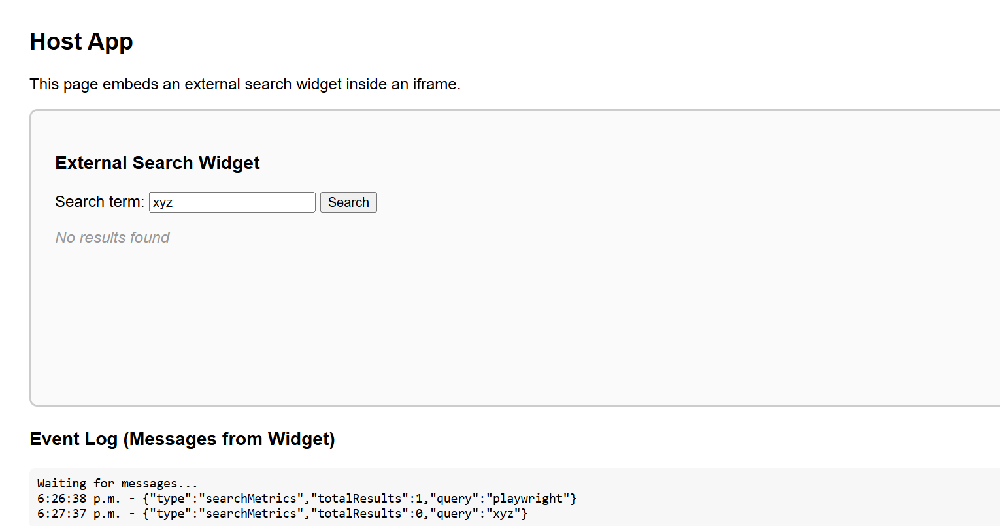

# QA Automation Challenge — External Iframe (Playwright)

This repository contains an automated QA solution for testing a **cross-origin iframe integration** using **Playwright + TypeScript**.

The system under test simulates a real-world scenario where a **host application** embeds a **third-party search widget** inside an iframe and communicates with it via `window.postMessage`.

The purpose of this project is to validate iframe interaction, cross-origin communication, UI behavior, keyboard accessibility, and correct event messaging.

---

## 🎯 Objectives Covered

- Validate that a cross-origin iframe loads correctly
- Interact with the iframe using Playwright `frame()` API
- Perform valid and invalid searches inside the widget
- Verify search results and “No results” UI states
- Assert `postMessage` events sent from widget to host:
  - `searchMetrics`
  - `resultClick`
- Validate keyboard accessibility (Enter key activates result)
- Demonstrate Playwright UI Mode and HTML reporting

---

## 🛠 Tech Stack

- Playwright Test
- TypeScript
- Node.js
- HTML / JavaScript

---

## 📁 Project Structure

```
.
├── host/
│   └── host.html
├── widget/
│   └── widget.html
├── tests/
│   └── search.spec.ts
├── screenshots/
│   ├── Playwright_UI-NoResult.PNG
│   ├── Playwright_UI.PNG
│   └── Report1.png
├── playwright.config.ts
├── test-plan.md
├── package.json
└── README.md
```

---

## ⚙️ Prerequisites

- Node.js (LTS recommended)
- npm
- Optional:
  - VS Code
  - Playwright Test VS Code extension

---

## 🚀 Installation

```bash
npm install
npx playwright install
```

---

## 🌍 Serve the Demo Application (Simulated Cross-Origin)

### Terminal 1 — Host Application
```bash
npx http-server host -p 8000
```

### Terminal 2 — Widget Application
```bash
npx http-server widget -p 8001
```

Open:
http://localhost:8000/host.html

---

## ▶️ Running the Tests

### Headless
```bash
npx playwright test
```

### UI Mode (recommended)
```bash
npx playwright test --ui
```

### Headed Mode
```bash
npx playwright test --headed --slow-mo=300
```

---

## 🧪 Playwright UI Mode Screenshots




---

## 📊 HTML Report

```bash
npx playwright show-report
```


---

## 🧠 Design & QA Considerations

- Widget treated as third-party SDK
- Cross-origin communication validated via postMessage
- Stable selectors used for deterministic tests
- Keyboard accessibility validated

---

## 🧪 Future Improvements

1. Host security validation for unexpected origins
2. Multi-search flow validation
3. Accessibility audit (ARIA, tab order)

---

## ✅ Summary

This project demonstrates professional QA automation practices for cross-origin iframe integrations using Playwright.
